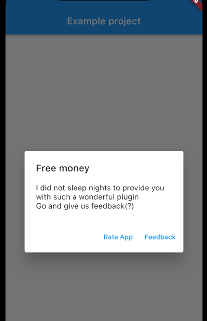

# in_app_review_plugin

In app review plugin


# Description
This plugin provides the dialog window with 2 options available
* Rate application in Google Play/App store
* Leave feedback and send it to specified email



## Application Rating
It uses the In-App Review API on Android and the SKStoreReviewController on iOS/MacOS.


### Acknowledgements
* Android: in app review is only available when the application is uploaded to Play Market. You use your developer account for testing and internal app sharing.
* iOS: in app review UI is working without uploading, but submit button will be active only when the application is downloaded through App Store (you can also use TestFlight)

## Sending feedback
Plugin allows sending email with one method. sendEmail  
Need to call InAppReviewPlugin.send_email and pass required arguments
* message
* name
* service id
* template id
* public token

It uses [emailjs](https://www.emailjs.com) service that can trigger email sending via API calls.
You need to create free account and connect real email account which will be used as sender


# Usage
## `requestReview()`

The following code triggers the In-App Review prompt. This should **not** be used frequently as the underlying API's enforce strict quotas on this feature to provide a great user experience.

```dart
import 'package:in_app_review_plugin/in_app_review_plugin.dart';

final _inAppReviewPlugin = InAppReviewPlugin();


...
    _inAppReviewPlugin.requestReview();
...
```
### Do
- Use this after a user has experienced your app for long enough to provide useful feedback, e.g., after the completion of a game level or after a few days.
- Use this sparingly otherwise no pop up will appear.

### Avoid
- Triggering this via a button in your app as it will only work when the quota enforced by the underlying API has not been exceeded. ([Android](https://developer.android.com/guide/playcore/in-app-review#quotas))
- Interrupting the user if they are mid way through a task.

---
# Testing
## Android
You must upload your app to the Play Store to test `requestReview()`. An easy way to do this is to build an apk/app bundle and upload it via [internal app sharing](https://play.google.com/apps/publish/internalappsharing/).

Real reviews cannot be created while testing `requestReview()` and the **submit** button is disabled to emphasize this.

More details at https://developer.android.com/guide/playcore/in-app-review/test

## IOS
`requestReview()` can be tested via the IOS simulator or on a physical device.
Note that `requestReview()` has no effect when testing via TestFlight [as documented](https://developer.apple.com/documentation/storekit/skstorereviewcontroller/2851536-requestreview#discussion).

Real reviews cannot be created while testing `requestReview()` and the **submit** button is disabled to emphasize this.


# Requirements
## Android
Requires Android 5 Lollipop(API 21) or higher and the Google Play Store must be installed.
## IOS
Requires IOS version 10.3

